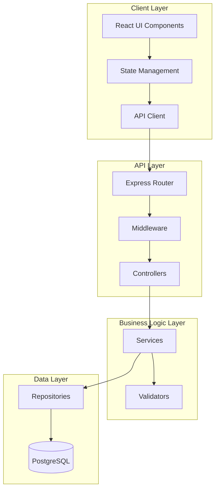

# Design Document

## Overview

The Personal Finance Tracker is a web-based application built with a modern tech stack to provide users with an intuitive interface for managing financial transactions. The system follows a three-tier architecture with a React-based frontend, RESTful API backend, and relational database for persistent storage.

**Phase 1 Scope**: Web application only. Mobile app development will be considered in future phases once the web application is stable and fully functional.

### Technology Stack

- **Frontend**: React with TypeScript, Material-UI for components, Chart.js/Recharts for visualizations
- **Backend**: Node.js with Express.js
- **Database**: PostgreSQL
- **State Management**: React Context API or Redux
- **Form Handling**: React Hook Form with Yup validation
- **Date Handling**: date-fns or Day.js

## Architecture

### System Architecture Diagram



### Component Architecture

The application is divided into two main sections:

1. **User Interface**: Transaction management and dashboard visualization (users can only select from existing configuration items)
2. **Admin Interface**: Exclusive configuration management for system metadata (Type, Category, Sub-Category, Mode, Account)

**Phase 1 Scope**: All users have access to both transaction management and configuration management features. Authentication and role-based access control will be added in a future phase.

## Components and Interfaces

### Frontend Components

#### 1. Transaction Management Module

**MonthlyTrackingCycleManager Component**
- Purpose: Configure and manage monthly tracking cycles
- Features:
  - Set start date and end date for tracking cycle
  - View current active cycle
  - Create new cycle for next period
  - List of all tracking cycles
  - Validation to prevent overlapping cycles

**TransactionForm Component**
- Purpose: Input form for creating/editing transactions
- Props: `transaction?: Transaction, onSubmit: (data: Transaction) => void, onCancel: () => void`
- Features:
  - Date picker for transaction date
  - Dropdown for transaction type (Income/Expense)
  - Cascading dropdowns for category and sub-category (filtered by type)
  - Dropdown for payment mode
  - Dropdown for account
  - Number input for amount
  - Text area for description
  - Real-time validation with error messages

**TransactionList Component**
- Purpose: Display transactions in a table/list format
- Props: `transactions: Transaction[], onEdit: (id: string) => void, onDelete: (id: string) => void`
- Features:
  - Sortable columns
  - Visual distinction between income (green) and expense (red)
  - Action buttons for edit/delete
  - Pagination or infinite scroll
  - Empty state when no transactions

**DateRangeFilter Component**
- Purpose: Filter transactions by date range
- Props: `onFilterChange: (startDate: Date, endDate: Date) => void`
- Features:
  - Start date picker
  - End date picker
  - Validation (end date >= start date)
  - Clear filter button
  - Quick select options (This Month, Last Month, Last 3 Months, etc.)

#### 2. Dashboard Module

**DashboardSummary Component**
- Purpose: Display key financial metrics for the selected tracking cycle
- Props: `trackingCycleId?: number`
- Features:
  - Tracking cycle selector dropdown
  - Total Income card
  - Total Expenses card
  - Net Balance card
  - Visual indicators (positive/negative)
  - Responsive grid layout
  - Display cycle date range

**ExpenseByCategoryChart Component**
- Purpose: Visualize expense distribution for the selected tracking cycle
- Props: `trackingCycleId?: number`
- Features:
  - Tracking cycle selector dropdown
  - Pie or donut chart
  - Category labels with amounts and percentages
  - Interactive tooltips
  - Legend
  - Responsive sizing

**MonthlyTrendChart Component**
- Purpose: Show income/expense trends over time
- Props: `months: number`
- Features:
  - Line or bar chart
  - Dual series (income and expense)
  - X-axis: months
  - Y-axis: amount
  - Color coding (income: green, expense: red)
  - Interactive tooltips
  - Zoom/pan capabilities

#### 3. Admin Configuration Module

**AdminPanel Component**
- Purpose: Container for all admin configuration sections
- Features:
  - Tab navigation for different configuration types
  - Sections: Transaction Types, Categories, Sub-Categories, Payment Modes, Accounts
  - **Phase 1**: Accessible to all users without authentication

**ConfigurationManager Component**
- Purpose: Generic CRUD interface for configuration items
- Props: `type: ConfigType, items: ConfigItem[], onAdd, onEdit, onDelete`
- Features:
  - List view of existing items
  - Add new item form
  - Edit inline or modal
  - Delete with confirmation
  - Validation messages
  - Prevention of deletion when items are in use

**CategoryManager Component**
- Purpose: Specialized interface for hierarchical category management
- Features:
  - Transaction type selector
  - Category list with sub-categories
  - Tree view or nested list
  - Add category/sub-category forms
  - Drag-and-drop reordering (optional)

### Backend API Endpoints

#### Transaction Endpoints
```
POST   /api/transactions          - Create transaction
GET    /api/transactions          - Get all transactions (with filters including trackingCycleId)
GET    /api/transactions/:id      - Get transaction by ID
PUT    /api/transactions/:id      - Update transaction
DELETE /api/transactions/:id      - Delete transaction
```

#### Tracking Cycle Endpoints
```
GET    /api/tracking-cycles       - Get all tracking cycles
GET    /api/tracking-cycles/active - Get current active tracking cycle
GET    /api/tracking-cycles/:id   - Get tracking cycle by ID
POST   /api/tracking-cycles       - Create new tracking cycle
PUT    /api/tracking-cycles/:id   - Update tracking cycle
DELETE /api/tracking-cycles/:id   - Delete tracking cycle
```

#### Dashboard Endpoints
```
GET    /api/dashboard/summary     - Get financial summary (with optional trackingCycleId)
GET    /api/dashboard/expenses-by-category - Get expense breakdown (with optional trackingCycleId)
GET    /api/dashboard/monthly-trend - Get monthly income/expense trend across cycles
```

#### Configuration Endpoints (Admin Only)
```
GET    /api/config/types          - Get all transaction types (public)
POST   /api/config/types          - Create transaction type (admin only)
DELETE /api/config/types/:id      - Delete transaction type (admin only)

GET    /api/config/categories     - Get all categories (public, with optional type filter)
POST   /api/config/categories     - Create category (admin only)
PUT    /api/config/categories/:id - Update category (admin only)
DELETE /api/config/categories/:id - Delete category (admin only)

GET    /api/config/subcategories  - Get all sub-categories (public, with optional category filter)
POST   /api/config/subcategories  - Create sub-category (admin only)
PUT    /api/config/subcategories/:id - Update sub-category (admin only)
DELETE /api/config/subcategories/:id - Delete sub-category (admin only)

GET    /api/config/modes          - Get all payment modes (public)
POST   /api/config/modes          - Create payment mode (admin only)
DELETE /api/config/modes/:id      - Delete payment mode (admin only)

GET    /api/config/accounts       - Get all accounts (public)
POST   /api/config/accounts       - Create account (admin only)
DELETE /api/config/accounts/:id   - Delete account (admin only)
```

**Note**: GET endpoints are accessible to all users. In Phase 1, POST, PUT, and DELETE endpoints are also accessible without authentication. Future phases will add role-based access control.

## Data Models

### Database Schema

```sql
-- Tracking Cycles Table
CREATE TABLE tracking_cycles (
    id SERIAL PRIMARY KEY,
    name VARCHAR(100) NOT NULL,
    start_date DATE NOT NULL,
    end_date DATE NOT NULL,
    is_active BOOLEAN DEFAULT false,
    created_at TIMESTAMP DEFAULT CURRENT_TIMESTAMP,
    updated_at TIMESTAMP DEFAULT CURRENT_TIMESTAMP,
    CHECK (end_date >= start_date)
);

-- Users Table (for future authentication phase)
CREATE TABLE users (
    id SERIAL PRIMARY KEY,
    username VARCHAR(50) NOT NULL UNIQUE,
    email VARCHAR(100) NOT NULL UNIQUE,
    password_hash VARCHAR(255) NOT NULL,
    role VARCHAR(20) NOT NULL CHECK (role IN ('user', 'admin')),
    created_at TIMESTAMP DEFAULT CURRENT_TIMESTAMP,
    updated_at TIMESTAMP DEFAULT CURRENT_TIMESTAMP
);

-- Transaction Types Table
CREATE TABLE transaction_types (
    id SERIAL PRIMARY KEY,
    name VARCHAR(50) NOT NULL UNIQUE,
    created_at TIMESTAMP DEFAULT CURRENT_TIMESTAMP
);

-- Categories Table
CREATE TABLE categories (
    id SERIAL PRIMARY KEY,
    name VARCHAR(100) NOT NULL,
    transaction_type_id INTEGER NOT NULL REFERENCES transaction_types(id),
    created_at TIMESTAMP DEFAULT CURRENT_TIMESTAMP,
    UNIQUE(name, transaction_type_id)
);

-- Sub-Categories Table
CREATE TABLE sub_categories (
    id SERIAL PRIMARY KEY,
    name VARCHAR(100) NOT NULL,
    category_id INTEGER NOT NULL REFERENCES categories(id) ON DELETE RESTRICT,
    created_at TIMESTAMP DEFAULT CURRENT_TIMESTAMP,
    UNIQUE(name, category_id)
);

-- Payment Modes Table
CREATE TABLE payment_modes (
    id SERIAL PRIMARY KEY,
    name VARCHAR(50) NOT NULL UNIQUE,
    created_at TIMESTAMP DEFAULT CURRENT_TIMESTAMP
);

-- Accounts Table
CREATE TABLE accounts (
    id SERIAL PRIMARY KEY,
    name VARCHAR(100) NOT NULL UNIQUE,
    created_at TIMESTAMP DEFAULT CURRENT_TIMESTAMP
);

-- Transactions Table
CREATE TABLE transactions (
    id SERIAL PRIMARY KEY,
    tracking_cycle_id INTEGER REFERENCES tracking_cycles(id),
    user_id INTEGER REFERENCES users(id),
    date DATE NOT NULL,
    transaction_type_id INTEGER NOT NULL REFERENCES transaction_types(id),
    category_id INTEGER NOT NULL REFERENCES categories(id),
    sub_category_id INTEGER NOT NULL REFERENCES sub_categories(id),
    payment_mode_id INTEGER NOT NULL REFERENCES payment_modes(id),
    account_id INTEGER NOT NULL REFERENCES accounts(id),
    amount DECIMAL(12, 2) NOT NULL CHECK (amount > 0),
    description TEXT,
    created_at TIMESTAMP DEFAULT CURRENT_TIMESTAMP,
    updated_at TIMESTAMP DEFAULT CURRENT_TIMESTAMP
);

-- Indexes for performance
CREATE INDEX idx_transactions_tracking_cycle ON transactions(tracking_cycle_id);
CREATE INDEX idx_transactions_user ON transactions(user_id);
CREATE INDEX idx_transactions_date ON transactions(date);
CREATE INDEX idx_transactions_type ON transactions(transaction_type_id);
CREATE INDEX idx_transactions_category ON transactions(category_id);
CREATE INDEX idx_categories_type ON categories(transaction_type_id);
CREATE INDEX idx_subcategories_category ON sub_categories(category_id);
CREATE INDEX idx_tracking_cycles_dates ON tracking_cycles(start_date, end_date);
CREATE INDEX idx_tracking_cycles_active ON tracking_cycles(is_active);
```

### TypeScript Interfaces

```typescript
// Core Models
interface TrackingCycle {
    id: number;
    name: string;
    startDate: Date;
    endDate: Date;
    isActive: boolean;
    createdAt: Date;
    updatedAt: Date;
}

interface User {
    id: number;
    username: string;
    email: string;
    role: 'user' | 'admin';
    createdAt: Date;
    updatedAt: Date;
}

interface TransactionType {
    id: number;
    name: string;
    createdAt: Date;
}

interface Category {
    id: number;
    name: string;
    transactionTypeId: number;
    transactionType?: TransactionType;
    createdAt: Date;
}

interface SubCategory {
    id: number;
    name: string;
    categoryId: number;
    category?: Category;
    createdAt: Date;
}

interface PaymentMode {
    id: number;
    name: string;
    createdAt: Date;
}

interface Account {
    id: number;
    name: string;
    createdAt: Date;
}

interface Transaction {
    id: number;
    trackingCycleId?: number;
    userId?: number;
    date: Date;
    transactionTypeId: number;
    categoryId: number;
    subCategoryId: number;
    paymentModeId: number;
    accountId: number;
    amount: number;
    description?: string;
    createdAt: Date;
    updatedAt: Date;
    // Populated relations
    trackingCycle?: TrackingCycle;
    user?: User;
    transactionType?: TransactionType;
    category?: Category;
    subCategory?: SubCategory;
    paymentMode?: PaymentMode;
    account?: Account;
}

// DTOs
interface CreateTrackingCycleDTO {
    name: string;
    startDate: string;
    endDate: string;
}

interface UpdateTrackingCycleDTO extends Partial<CreateTrackingCycleDTO> {
    isActive?: boolean;
}

interface CreateTransactionDTO {
    trackingCycleId?: number;
    date: string;
    transactionTypeId: number;
    categoryId: number;
    subCategoryId: number;
    paymentModeId: number;
    accountId: number;
    amount: number;
    description?: string;
}

interface UpdateTransactionDTO extends Partial<CreateTransactionDTO> {}

interface TransactionFilters {
    startDate?: string;
    endDate?: string;
    trackingCycleId?: number;
    transactionTypeId?: number;
    categoryId?: number;
    accountId?: number;
}

// Dashboard DTOs
interface DashboardSummary {
    totalIncome: number;
    totalExpenses: number;
    netBalance: number;
    period: {
        startDate: string;
        endDate: string;
    };
    trackingCycle?: TrackingCycle;
}

interface ExpenseByCategory {
    categoryId: number;
    categoryName: string;
    amount: number;
    percentage: number;
}

interface MonthlyTrend {
    month: string;
    income: number;
    expenses: number;
}
```

## Error Handling

### Frontend Error Handling

1. **Form Validation Errors**
   - Display inline error messages below form fields
   - Prevent form submission until all errors are resolved
   - Use Yup schema validation

2. **API Errors**
   - Display toast notifications for API errors
   - Show user-friendly error messages
   - Log detailed errors to console for debugging

3. **Network Errors**
   - Display connection error message
   - Provide retry mechanism
   - Show offline indicator

### Backend Error Handling

1. **Validation Errors** (400 Bad Request)
   ```json
   {
       "error": "Validation Error",
       "details": [
           {
               "field": "amount",
               "message": "Amount must be a positive number"
           }
       ]
   }
   ```

2. **Not Found Errors** (404 Not Found)
   ```json
   {
       "error": "Resource Not Found",
       "message": "Transaction with ID 123 not found"
   }
   ```

3. **Conflict Errors** (409 Conflict)
   ```json
   {
       "error": "Conflict",
       "message": "Cannot delete category with existing sub-categories"
   }
   ```

4. **Server Errors** (500 Internal Server Error)
   ```json
   {
       "error": "Internal Server Error",
       "message": "An unexpected error occurred"
   }
   ```

### Error Handling Middleware

```typescript
// Express error handling middleware
app.use((err: Error, req: Request, res: Response, next: NextFunction) => {
    console.error(err.stack);
    
    if (err instanceof ValidationError) {
        return res.status(400).json({
            error: 'Validation Error',
            details: err.details
        });
    }
    
    if (err instanceof NotFoundError) {
        return res.status(404).json({
            error: 'Resource Not Found',
            message: err.message
        });
    }
    
    if (err instanceof ConflictError) {
        return res.status(409).json({
            error: 'Conflict',
            message: err.message
        });
    }
    
    res.status(500).json({
        error: 'Internal Server Error',
        message: 'An unexpected error occurred'
    });
});
```

## Testing Strategy

### Frontend Testing

1. **Unit Tests**
   - Test utility functions (date formatting, calculations)
   - Test validation schemas
   - Test custom hooks
   - Tool: Jest

2. **Component Tests**
   - Test component rendering
   - Test user interactions
   - Test form submissions
   - Tool: React Testing Library

3. **Integration Tests**
   - Test API integration
   - Test state management
   - Tool: React Testing Library with MSW (Mock Service Worker)

### Backend Testing

1. **Unit Tests**
   - Test service layer logic
   - Test validation functions
   - Test utility functions
   - Tool: Jest

2. **Integration Tests**
   - Test API endpoints
   - Test database operations
   - Test error handling
   - Tool: Jest with Supertest

3. **Database Tests**
   - Test repository methods
   - Test database constraints
   - Tool: Jest with test database

### Test Coverage Goals
- Minimum 70% code coverage
- 100% coverage for critical business logic (calculations, validations)
- All API endpoints tested

## UI/UX Design Principles

### Visual Design

1. **Color Scheme**
   - Primary: Blue (#1976d2) for main actions
   - Success/Income: Green (#4caf50)
   - Error/Expense: Red (#f44336)
   - Neutral: Gray shades for backgrounds and borders
   - Use Material-UI theme for consistency

2. **Typography**
   - Font family: Roboto (Material-UI default)
   - Clear hierarchy with appropriate font sizes
   - Readable line heights and spacing

3. **Layout**
   - Responsive grid system
   - Consistent spacing (8px base unit)
   - Card-based design for content sections
   - Sticky header with navigation

### User Experience

1. **Navigation**
   - Top navigation bar with sections: Dashboard, Transactions, Admin
   - Active state indication
   - Mobile-friendly hamburger menu

2. **Feedback**
   - Loading spinners for async operations
   - Success/error toast notifications
   - Disabled states for buttons during processing
   - Confirmation dialogs for destructive actions

3. **Accessibility**
   - ARIA labels for screen readers
   - Keyboard navigation support
   - Focus indicators
   - Sufficient color contrast ratios

4. **Performance**
   - Lazy loading for charts
   - Pagination for large transaction lists
   - Debounced search/filter inputs
   - Optimistic UI updates

### Responsive Design

- Mobile-first approach
- Breakpoints:
  - Mobile: < 600px
  - Tablet: 600px - 960px
  - Desktop: > 960px
- Stack components vertically on mobile
- Side-by-side layout on desktop

## Security Considerations

1. **Input Validation**
   - Validate all inputs on both frontend and backend
   - Sanitize user inputs to prevent XSS
   - Use parameterized queries to prevent SQL injection

2. **Authentication and Authorization**
   - **Phase 1**: Guest access mode - no authentication required
   - Users can access all features without login
   - Admin features can be accessed without role verification in Phase 1
   - **Future Phase**: JWT-based authentication with secure password hashing (bcrypt)
   - **Future Phase**: Role-based access control (User/Admin) with middleware verification
   - **Future Phase**: Admin-only endpoints protected with role verification

3. **API Security**
   - CORS configuration
   - Rate limiting
   - Request size limits
   - HTTPS in production
   - Admin-only endpoints protected with role verification

4. **Data Protection**
   - Environment variables for sensitive config
   - No sensitive data in client-side code
   - Secure database connection strings

## Deployment Architecture

### Development Environment
- Frontend: React dev server (port 3000)
- Backend: Node.js server (port 5000)
- Database: Local PostgreSQL instance

### Production Environment
- Frontend: Static files served via CDN or Nginx
- Backend: Node.js server behind reverse proxy
- Database: Managed PostgreSQL service (AWS RDS, Heroku Postgres, etc.)
- Environment: Docker containers (optional)

### CI/CD Pipeline
1. Code push to repository
2. Run linting and tests
3. Build frontend and backend
4. Deploy to staging environment
5. Run smoke tests
6. Deploy to production (manual approval)
