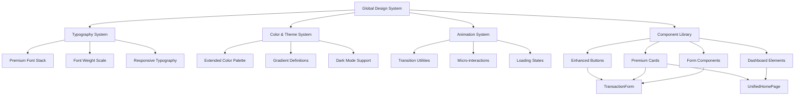

# Design Document: Premium UI Enhancement

## Overview

This feature transforms the Personal Finance Management App into a premium, bold, and dynamic user experience. The enhancement focuses on three core pillars: typography (bolder, more impactful fonts), visual dynamics (smooth animations, micro-interactions, and depth), and premium aesthetics (refined color palettes, gradients, and elevated design patterns). The design maintains accessibility standards while creating a sophisticated, modern interface that feels responsive and delightful to use.

The enhancement targets global styles, key components (TransactionForm, UnifiedHomePage), and introduces a cohesive design system that can scale across the entire application. All changes are implemented using Tailwind CSS utilities and custom CSS variables for maintainability.

## Architecture

## Technical Approach

### Typography System Implementation

The typography system will be implemented through CSS custom properties and Tailwind CSS theme extensions:

- **Font Stack**: Inter font family loaded via Google Fonts or self-hosted with font-display: swap
- **Font Weights**: Define custom properties for weights 400, 500, 600, 700, 800
- **Responsive Scaling**: Use clamp() function for fluid typography that scales between viewport sizes
- **Line Heights**: Set base line-height of 1.5 for body text, 1.2 for headings

Implementation will extend Tailwind's theme configuration to include custom font weight utilities and responsive text size classes.

### Color and Theme System Implementation

The color system will extend the existing palette with additional shades and gradient definitions:

- **Extended Palette**: Add 50, 100, 200...900 shades for each color family
- **CSS Custom Properties**: Define gradients as reusable custom properties (--gradient-primary, --gradient-accent)
- **Dark Mode**: Use CSS custom properties that change based on [data-theme="dark"] attribute
- **Contrast Validation**: Ensure all color combinations meet WCAG 2.1 AA standards (4.5:1 for text, 3:1 for UI)

Implementation will use Tailwind's color configuration and CSS custom properties for theme switching.

### Animation System Implementation

The animation system will provide smooth, performant transitions:

- **Transition Utilities**: Define custom Tailwind utilities for common transition patterns
- **Timing Functions**: Use ease-in-out and custom cubic-bezier curves for natural motion
- **GPU Acceleration**: Limit animations to transform and opacity properties
- **Reduced Motion**: Wrap animations in @media (prefers-reduced-motion: no-preference) queries

Implementation will extend Tailwind's transition configuration and create custom animation utilities.

### Component Library Implementation

Enhanced components will be implemented by extending existing components with premium styling:

- **Buttons**: Add gradient backgrounds, hover scale transforms, focus rings, and disabled states
- **Cards**: Apply box-shadows, rounded corners, hover effects, and gradient accents
- **Forms**: Enhance input focus states, validation styling, and consistent sizing
- **Dashboard**: Apply bold typography to statistics, color-coded trends, and responsive grid layouts

Implementation will modify existing component files (TransactionForm.tsx, UnifiedHomePage.tsx) and global styles (index.css).

### Performance Considerations

- **CSS Bundle Size**: Monitor total CSS size to stay under 100KB compressed
- **Font Loading**: Use font-display: swap to prevent render blocking
- **Animation Performance**: Use transform and opacity for GPU acceleration
- **Event Optimization**: Debounce scroll and resize event handlers

## Correctness Properties

*A property is a characteristic or behavior that should hold true across all valid executions of a system—essentially, a formal statement about what the system should do. Properties serve as the bridge between human-readable specifications and machine-verifiable correctness guarantees.*

### Property 1: Typography Weight Consistency

*For any* text element in the application, if it is a heading element (h1-h6), then its computed font-weight should be 700 or higher; if it is body text, then its computed font-weight should be between 400 and 600; if it is a financial statistic value, then its computed font-weight should be 700 or higher.

**Validates: Requirements 1.3, 1.4, 7.1**

### Property 2: Responsive Typography Scaling

*For any* text element with responsive sizing, when the viewport width changes across breakpoints (mobile, tablet, desktop), the computed font-size should scale proportionally and remain readable at all viewport sizes.

**Validates: Requirements 1.5**

### Property 3: Line Height Readability

*For any* text element, if it is body text, then its computed line-height should be approximately 1.5; if it is a heading, then its computed line-height should be approximately 1.2.

**Validates: Requirements 1.6**

### Property 4: Dark Mode Color Adjustment

*For any* element with color styling, when dark mode is toggled on, the computed color values should change to appropriate dark mode variants that maintain readability and visual hierarchy.

**Validates: Requirements 2.4**

### Property 5: WCAG Contrast Compliance

*For any* text element and its background, the contrast ratio should be at least 4.5:1 for normal text and at least 3:1 for large text (18pt+) or UI components, in both light and dark modes.

**Validates: Requirements 2.5, 2.6, 4.6, 11.1**

### Property 6: Animation Duration Bounds

*For any* CSS transition or animation definition, the duration value should be between 150ms and 300ms for standard interactions, ensuring animations feel responsive without being jarring.

**Validates: Requirements 3.1**

### Property 7: Interactive Element Transitions

*For any* interactive element (button, card, input), when a user hovers over it, the element should have smooth transitions applied to properties like scale, color, or shadow, using appropriate easing functions.

**Validates: Requirements 3.2, 4.2, 5.2**

### Property 8: Button Click Feedback

*For any* button element, when the active/click state is triggered, the element should apply immediate visual feedback through transform (scale) or opacity changes.

**Validates: Requirements 3.3**

### Property 9: Natural Motion Easing

*For any* transition or animation, the timing function should use ease-in-out, cubic-bezier, or similar natural easing curves rather than linear timing.

**Validates: Requirements 3.4**

### Property 10: Loading Animation Presence

*For any* content that loads asynchronously, when the loading state is active, the UI should display fade-in or slide-in animations, or skeleton screens/spinners.

**Validates: Requirements 3.5, 9.5**

### Property 11: Reduced Motion Respect

*For any* animation or transition, when the user's system has prefers-reduced-motion enabled, the animation should be disabled or significantly reduced in intensity.

**Validates: Requirements 3.6, 11.3**

### Property 12: Button State Styling

*For any* button element, it should have distinct visual treatments for default (gradient or bold color), hover (scale + shadow), focus (visible ring with 2px offset), and disabled (opacity 0.5, pointer-events none) states.

**Validates: Requirements 4.1, 4.2, 4.3, 4.4**

### Property 13: Card Shadow and Depth

*For any* card element, it should have a box-shadow applied for depth perception, and if interactive, the shadow should enhance on hover along with a subtle lift effect (transform).

**Validates: Requirements 5.1, 5.2**

### Property 14: Card Border Radius Range

*For any* card element, its border-radius value should be between 8px and 16px, creating modern, rounded aesthetics.

**Validates: Requirements 5.3**

### Property 15: Premium Card Styling

*For any* card marked as premium, it should have either gradient backgrounds or subtle border treatments applied to distinguish it from standard cards.

**Validates: Requirements 5.4**

### Property 16: Card Focus Management

*For any* card containing interactive elements, when navigating via keyboard, the tab order should be logical and focus indicators should be visible on all focusable elements.

**Validates: Requirements 5.5**

### Property 17: Card Spacing Consistency

*For any* card variant (standard, premium, interactive), the padding and margin values should be consistent across all instances of that variant.

**Validates: Requirements 5.6**

### Property 18: Input Focus Styling

*For any* input field, when it receives focus, it should apply border-color changes and subtle glow effects (box-shadow) to indicate active state.

**Validates: Requirements 6.1**

### Property 19: Input Validation States

*For any* input field, when it contains an error, it should display red border styling and error message text; when successfully validated, it should display green border styling or success indicators.

**Validates: Requirements 6.2, 6.3**

### Property 20: Input Sizing Consistency

*For any* input field (text, select, date picker), its height should be between 40px and 48px, and padding should be between 12px and 16px, ensuring consistent sizing across form elements.

**Validates: Requirements 6.4**

### Property 21: Form Input Visual Consistency

*For any* form input type (select dropdown, date picker, text input), they should share common visual styling properties like border, background, and typography.

**Validates: Requirements 6.5**

### Property 22: Form Label Association

*For any* form input, it should have an associated label element with a matching for/id attribute pair, and error messages should be properly announced to screen readers via ARIA attributes.

**Validates: Requirements 6.6, 11.6**

### Property 23: Trend Indicator Color Coding

*For any* trend indicator displaying financial changes, positive trends should be styled with green colors and negative trends should be styled with red colors, with additional non-color indicators (arrows, icons) for accessibility.

**Validates: Requirements 7.2, 11.5**

### Property 24: Key Metric Highlighting

*For any* key metric display on the dashboard, it should have gradient backgrounds or accent colors applied to visually distinguish it from standard metrics.

**Validates: Requirements 7.3**

### Property 25: Dashboard Value Transitions

*For any* dashboard data value, when the value updates, the change should be animated with smooth transitions rather than instant replacement.

**Validates: Requirements 7.4**

### Property 26: Dashboard Responsive Layout

*For any* dashboard element container, it should use CSS Grid or Flexbox with responsive breakpoints that adapt the layout to different screen sizes.

**Validates: Requirements 7.5, 9.4**

### Property 27: Dashboard Accessibility

*For any* dashboard element, it should be keyboard navigable (proper tab order), have visible focus indicators, and include appropriate ARIA attributes for screen reader compatibility.

**Validates: Requirements 7.6**

### Property 28: TransactionForm Micro-interactions

*For any* form field in TransactionForm, when a user interacts with it (focus, input, blur), micro-interactions should trigger providing immediate feedback.

**Validates: Requirements 8.2**

### Property 29: TransactionForm Spacing Consistency

*For any* form element in TransactionForm, spacing (margins, padding) and alignment should be consistent across all elements, creating visual harmony.

**Validates: Requirements 8.4**

### Property 30: TransactionForm Validation Transitions

*For any* validation state change in TransactionForm, the transition to error or success states should be smooth with animation rather than instant.

**Validates: Requirements 8.5**

### Property 31: TransactionForm Accessibility

*For any* interactive element in TransactionForm, it should maintain accessibility standards including proper labels, focus management, and keyboard navigation support.

**Validates: Requirements 8.6**

### Property 32: UnifiedHomePage Statistics Styling

*For any* financial statistic displayed on UnifiedHomePage, it should use bold typography (font-weight 700+) and gradient accents to create visual emphasis.

**Validates: Requirements 9.2**

### Property 33: UnifiedHomePage Scroll Animations

*For any* section navigation on UnifiedHomePage, scrolling between sections should trigger smooth scroll animations rather than instant jumps.

**Validates: Requirements 9.3**

### Property 34: UnifiedHomePage Interactive States

*For any* interactive element on UnifiedHomePage, it should have proper hover states (with transitions) and focus states (with visible indicators) for all user interaction methods.

**Validates: Requirements 9.6**

### Property 35: Focus Indicator Visibility

*For any* interactive element in the application, when navigating via keyboard, a visible focus indicator (outline or ring) should be displayed with sufficient contrast and offset.

**Validates: Requirements 4.3, 11.2**

### Property 36: Semantic HTML Structure

*For any* page or component, the HTML structure should use semantic elements (header, nav, main, section, article, aside, footer) appropriately for screen reader navigation.

**Validates: Requirements 11.4**

### Property 37: GPU-Accelerated Animations

*For any* CSS animation or transition, it should primarily use transform and opacity properties rather than expensive properties like box-shadow or filter during animation.

**Validates: Requirements 12.1, 12.2**

### Property 38: CSS Gradient Implementation

*For any* gradient visual effect, it should be implemented using CSS gradients (linear-gradient, radial-gradient) rather than image assets.

**Validates: Requirements 12.3**

### Property 39: Scroll Event Optimization

*For any* animation or effect triggered by scroll or resize events, the event handler should use debouncing or throttling to limit execution frequency and maintain performance.

**Validates: Requirements 12.5**

## Testing Strategy

The premium UI enhancement will be validated through a dual testing approach:

### Unit Testing

Unit tests will focus on specific examples and edge cases:

- Verify that specific components (TransactionForm, UnifiedHomePage) render with expected class names
- Test that theme toggle switches between light and dark mode
- Verify that button variants (primary, secondary, outline, ghost) have distinct styling
- Test that form validation displays appropriate error/success states
- Verify that loading states display skeleton screens or spinners

### Property-Based Testing

Property tests will verify universal properties across all inputs (minimum 100 iterations per test):

- **Property 5 (WCAG Contrast)**: Generate random color combinations and verify contrast ratios meet WCAG standards
  - Tag: **Feature: premium-ui-enhancement, Property 5: For any text element and its background, the contrast ratio should be at least 4.5:1 for normal text and at least 3:1 for large text**

- **Property 6 (Animation Duration)**: Parse all CSS transition/animation definitions and verify durations fall within 150-300ms range
  - Tag: **Feature: premium-ui-enhancement, Property 6: For any CSS transition or animation definition, the duration value should be between 150ms and 300ms**

- **Property 11 (Reduced Motion)**: Verify that all animations are wrapped in prefers-reduced-motion media queries
  - Tag: **Feature: premium-ui-enhancement, Property 11: For any animation or transition, when prefers-reduced-motion is enabled, the animation should be disabled or reduced**

- **Property 14 (Card Border Radius)**: Query all card elements and verify border-radius values are between 8-16px
  - Tag: **Feature: premium-ui-enhancement, Property 14: For any card element, its border-radius value should be between 8px and 16px**

- **Property 20 (Input Sizing)**: Query all input elements and verify height is 40-48px and padding is 12-16px
  - Tag: **Feature: premium-ui-enhancement, Property 20: For any input field, its height should be between 40px and 48px, and padding should be between 12px and 16px**

### Manual Testing

Manual testing will verify subjective qualities:

- Visual review of premium aesthetics and design cohesion
- User experience testing for smoothness of animations
- Cross-browser compatibility testing (Chrome, Firefox, Safari, Edge)
- Responsive design testing across device sizes
- Accessibility testing with screen readers (NVDA, JAWS, VoiceOver)

## Implementation Plan

### Phase 1: Global Design System

1. Update global CSS (index.css) with CSS custom properties for typography, colors, and animations
2. Extend Tailwind configuration with custom theme values
3. Define utility classes for gradients, shadows, and transitions
4. Implement dark mode support with theme switching

### Phase 2: Component Library Enhancements

1. Enhance button components with premium styling and states
2. Enhance card components with shadows, hover effects, and variants
3. Enhance form input components with focus states and validation styling
4. Create dashboard element components with bold typography and color coding

### Phase 3: Key Component Updates

1. Update TransactionForm component with premium styling
2. Update UnifiedHomePage component with enhanced dashboard elements
3. Apply micro-interactions and animations throughout
4. Ensure accessibility compliance across all updates

### Phase 4: Testing and Refinement

1. Implement unit tests for component rendering and behavior
2. Implement property-based tests for universal properties
3. Conduct manual testing for visual quality and accessibility
4. Refine based on test results and user feedback

## Risks and Mitigations

### Risk: Performance Impact from Animations

**Mitigation**: Use GPU-accelerated properties (transform, opacity), debounce event handlers, and respect prefers-reduced-motion preferences.

### Risk: Accessibility Regression

**Mitigation**: Maintain WCAG 2.1 AA standards throughout, test with screen readers, ensure keyboard navigation works, and provide non-color indicators for information.

### Risk: CSS Bundle Size Growth

**Mitigation**: Monitor bundle size, use Tailwind's purge feature to remove unused styles, and keep total CSS under 100KB compressed.

### Risk: Browser Compatibility Issues

**Mitigation**: Test across major browsers, use CSS feature detection, and provide fallbacks for unsupported features.

### Risk: Design Inconsistency

**Mitigation**: Maintain a single source of truth for design tokens, use CSS custom properties, and document all utilities and patterns.

## Success Criteria

The premium UI enhancement will be considered successful when:

1. All components display premium aesthetics with bold typography, gradients, and smooth animations
2. All WCAG 2.1 AA accessibility standards are maintained or improved
3. All property-based tests pass with 100+ iterations
4. CSS bundle size remains under 100KB compressed
5. User feedback indicates improved visual appeal and user experience
6. Cross-browser compatibility is verified across Chrome, Firefox, Safari, and Edge
